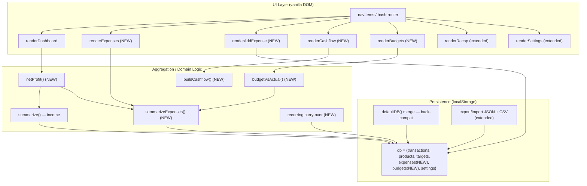
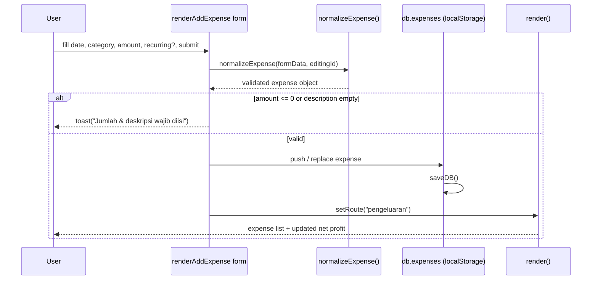
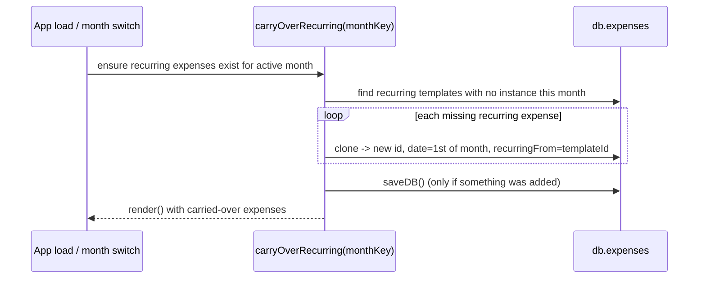
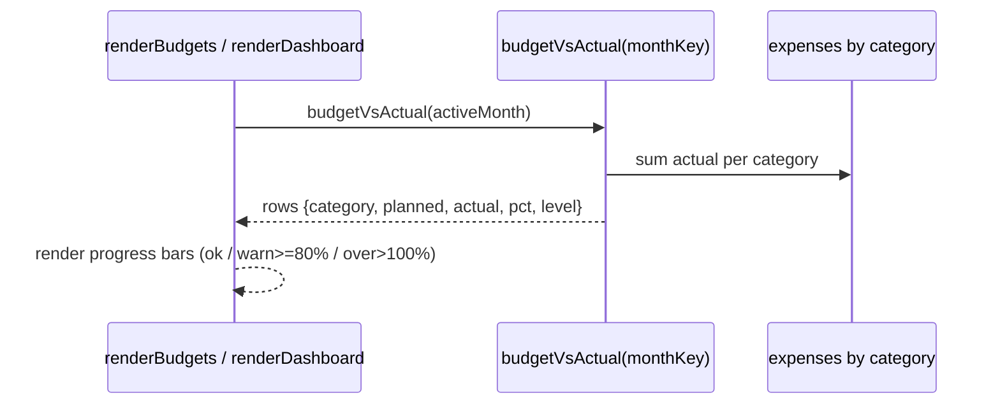

# Design Document: Expense & Bookkeeping Module (Pengeluaran)

## Overview

This feature adds a full **expense / bookkeeping module ("Pengeluaran")** to *Buku Keuangan Digital*, a pure-frontend PWA built with vanilla HTML/CSS/JavaScript and persisted in browser `localStorage` (key `bukuKeuanganDigital:v1`). Today the app only tracks income/sales and reports "profit" as a sales margin (`total - modal - discount - fee`). It has no concept of operating expenses, no true net profit, no cashflow timeline, and no expense budgeting.

The module introduces money-out tracking that is **not** tied to per-product modal: standalone expenses with their own categories (Iklan/Ads, Langganan Tools, Kuota/Internet, Listrik, Operasional, Fee Platform, Gaji/Komisi, Lainnya), recurring/monthly expense support, an expense list page mirroring the existing Transaksi page, and a set of bookkeeping analytics — **True Net Profit** (Gross Profit − Total Expenses), expense category breakdown, daily/monthly **cashflow** (money in vs out with surplus/deficit), and **per-category monthly budgets** with progress-bar warnings plus **Budget vs Actual** comparison. The Rekap view and CSV/JSON export/import are extended to include expense data and net profit.

The design stays strictly consistent with the existing architecture: no backend, no build step, no frameworks; a hash-router with one render function per view; a single `db` object in `localStorage` merged against `defaultDB()` for backward compatibility; and reuse of existing helpers (`money`, `number`, `summarize` patterns, `uid`, `toast`, theming, `escapeHTML`, `download`). The `db` schema is extended with an `expenses` array and a `budgets` structure, both additive so older backups remain importable.

---

## Architecture



The expense module is layered exactly like the existing income module: render functions read from `db`, call aggregation helpers, and write back through `saveDB()`. No new external dependency is introduced.

---

## Sequence Diagrams

### Recording an expense



### Monthly recurring carry-over



### Budget warning evaluation



---

## Components and Interfaces

### Component 1: Expense Store (data layer extension)

**Purpose**: Extend `db` with expenses and budgets while preserving backward compatibility.

**Interface**:
```javascript
// defaultDB() is extended; loadDB() shallow-merges so old backups stay valid.
function defaultDB() {
  return {
    transactions: [],
    products: [],
    targets: {},
    expenses: [],   // NEW: array of Expense
    budgets: {},    // NEW: { [monthKey]: { [expenseCategory]: amount } }
    settings: { theme: "light" }
  };
}
```

**Responsibilities**:
- Provide `expenses` and `budgets` defaults so `loadDB()` merge yields valid arrays/objects for legacy data.
- Normalize/persist via existing `saveDB()`.

### Component 2: Expense Views (router additions)

**Purpose**: New routes for capturing and reviewing expenses, cashflow, and budgets.

**Interface**:
```javascript
// navItems gains entries; routes map gains handlers.
const EXPENSE_CATEGORIES = [
  "Iklan/Ads", "Langganan Tools", "Kuota/Internet", "Listrik",
  "Operasional", "Fee Platform", "Gaji/Komisi", "Lainnya"
];

// new navItems: { id:"pengeluaran", ... }, { id:"cashflow", ... }, { id:"anggaran", ... }
const routes = {
  dashboard, tambah, transaksi, produk, rekap, pengaturan,
  pengeluaran: renderExpenses,        // list + filter + search
  "tambah-pengeluaran": renderAddExpense, // form (full + quick + recurring)
  cashflow: renderCashflow,           // daily & monthly money in/out
  anggaran: renderBudgets             // budget set + budget vs actual
};
```

**Responsibilities**:
- Render expense list mirroring `renderTransactions` (table on desktop, cards on mobile).
- Provide add/edit/duplicate/delete expense actions mirroring `bindTxActions`.
- Render cashflow timeline and budget management UI.

### Component 3: Bookkeeping Aggregators

**Purpose**: Pure functions computing expense summaries, net profit, cashflow, and budget comparison.

**Interface**:
```javascript
function summarizeExpenses(expenses): ExpenseSummary
function netProfit(monthKey): { income, grossProfit, expenses, net, isProfit }
function buildCashflow(monthKey, granularity /* "day" | "month" */): CashflowSeries
function budgetVsActual(monthKey): BudgetRow[]
function getExpensesForMonth(monthKey): Expense[]
```

**Responsibilities**:
- Read-only over `db`; no mutation, no DOM. Reused across dashboard, cashflow, budgets, and recap.

---

## Data Models

### Model 1: Expense

```javascript
/**
 * @typedef {Object} Expense
 * @property {string}  id          // uid("exp")
 * @property {number}  createdAt   // Date.now()
 * @property {number}  updatedAt   // Date.now()
 * @property {string}  date        // "YYYY-MM-DD"
 * @property {string}  name        // description / label (required)
 * @property {string}  category    // one of EXPENSE_CATEGORIES
 * @property {number}  amount      // money-out, > 0 (required)
 * @property {string}  payment     // reuse PAYMENTS list
 * @property {boolean} recurring   // true = monthly recurring template/instance
 * @property {string=} recurringFrom // id of the template this was carried from
 * @property {string}  note
 */
```

**Validation Rules**:
- `name` must be non-empty (trimmed).
- `amount` must be a positive number (`number(amount) > 0`).
- `category` defaults to `"Lainnya"` if missing/unknown.
- `date` defaults to `today()`; month derived via existing `getMonthKey(date)`.
- `recurring` is boolean; `recurringFrom` only present on carried instances.

### Model 2: Budgets

```javascript
/**
 * budgets: {
 *   [monthKey: "YYYY-MM"]: {
 *     [expenseCategory: string]: number  // planned amount for that category/month
 *   }
 * }
 * Mirrors db.targets (which is { [monthKey]: number } for revenue),
 * but keyed two levels deep: month -> category -> planned amount.
 */
```

**Validation Rules**:
- Planned amounts coerced via `number()`; zero/blank means "no budget set".
- Unknown categories ignored on read; only `EXPENSE_CATEGORIES` rendered.

### Model 3: Derived (in-memory) types

```javascript
/** @typedef {Object} ExpenseSummary
 *  @property {number} total      // sum of amounts
 *  @property {number} count
 *  @property {{label:string,value:number}} topCategory
 *  @property {Object<string,number>} byCategory  // category -> total
 */

/** @typedef {Object} CashflowPoint
 *  @property {string} key        // date "YYYY-MM-DD" or month "YYYY-MM"
 *  @property {number} in         // income (active, non-refund)
 *  @property {number} out        // expenses
 *  @property {number} net        // in - out (surplus if >=0, deficit if <0)
 */

/** @typedef {Object} BudgetRow
 *  @property {string} category
 *  @property {number} planned
 *  @property {number} actual
 *  @property {number} pct        // actual/planned*100 (0 if planned=0)
 *  @property {"none"|"ok"|"warn"|"over"} level
 */
```

---

## Algorithmic Pseudocode

### True Net Profit

```pascal
ALGORITHM netProfit(monthKey)
INPUT: monthKey of type String "YYYY-MM"
OUTPUT: result { income, grossProfit, expenses, net, isProfit }

BEGIN
  tx        ← getTransactionsForMonth(monthKey)
  incomeSum ← summarize(tx)            // existing helper (excludes Refund)
  expSum    ← summarizeExpenses(getExpensesForMonth(monthKey))

  result.income      ← incomeSum.omzet
  result.grossProfit ← incomeSum.profit        // sales margin (existing definition)
  result.expenses    ← expSum.total
  result.net         ← incomeSum.profit - expSum.total
  result.isProfit    ← result.net >= 0

  RETURN result
END
```

**Preconditions:** `monthKey` is a valid `"YYYY-MM"` string; `db.transactions` and `db.expenses` are arrays.
**Postconditions:** `net = grossProfit - expenses`; `isProfit` is true iff `net >= 0`; no mutation of `db`.
**Loop Invariants:** N/A (delegates to `summarize`/`summarizeExpenses`).

### Expense summary & category breakdown

```pascal
ALGORITHM summarizeExpenses(expenses)
INPUT: expenses : list of Expense
OUTPUT: summary { total, count, byCategory, topCategory }

BEGIN
  total      ← 0
  byCategory ← empty map

  FOR each e IN expenses DO
    ASSERT amountAccumulatedConsistent(total, byCategory)  // invariant
    a ← number(e.amount)
    total ← total + a
    byCategory[e.category] ← (byCategory[e.category] OR 0) + a
  END FOR

  topCategory ← argmax over byCategory by value  (label "-" if empty)

  summary.total       ← total
  summary.count       ← length(expenses)
  summary.byCategory  ← byCategory
  summary.topCategory ← topCategory
  RETURN summary
END
```

**Preconditions:** `expenses` is a list (possibly empty) of well-formed Expense objects.
**Postconditions:** `total = Σ number(e.amount)`; `Σ byCategory.values = total`; `topCategory` is the category with the maximum accumulated amount (or `{label:"-", value:0}` when empty).
**Loop Invariants:** After processing the first *k* expenses, `total` equals the sum of those *k* amounts and `byCategory` holds their per-category partial sums.

### Cashflow aggregation (daily & monthly)

```pascal
ALGORITHM buildCashflow(monthKey, granularity)
INPUT: monthKey : String, granularity : {"day","month"}
OUTPUT: series : list of CashflowPoint ordered by key ascending

BEGIN
  IF granularity = "day" THEN
    tx  ← getTransactionsForMonth(monthKey)     // restrict to month
    exp ← getExpensesForMonth(monthKey)
    keyOf(d) ← d                                // full "YYYY-MM-DD"
  ELSE
    tx  ← db.transactions                       // all-time monthly trend
    exp ← db.expenses
    keyOf(d) ← getMonthKey(d)                    // "YYYY-MM"
  END IF

  points ← empty map keyed by bucket

  FOR each t IN tx WHERE isActive(t) DO          // refunds excluded from money-in
    k ← keyOf(t.date)
    points[k].in ← points[k].in + calcTotal(t)
  END FOR

  FOR each e IN exp DO
    k ← keyOf(e.date)
    points[k].out ← points[k].out + number(e.amount)
  END FOR

  FOR each k IN points DO
    points[k].net ← points[k].in - points[k].out
  END FOR

  series ← sort points by key ascending
  RETURN series
END
```

**Preconditions:** `granularity ∈ {"day","month"}`; dates are `"YYYY-MM-DD"`.
**Postconditions:** For every point, `net = in - out`; income excludes refunds (`isActive`); buckets cover exactly the dates/months that have any income or expense; series sorted ascending by `key`.
**Loop Invariants:** While accumulating, each `points[k].in/out` equals the partial sum of all processed items mapping to bucket `k`.

### Budget vs Actual

```pascal
ALGORITHM budgetVsActual(monthKey)
INPUT: monthKey : String
OUTPUT: rows : list of BudgetRow (one per EXPENSE_CATEGORY having a budget or spend)

BEGIN
  planned ← db.budgets[monthKey] OR empty map
  actual  ← summarizeExpenses(getExpensesForMonth(monthKey)).byCategory

  rows ← empty list
  FOR each cat IN union(keys(planned), keys(actual)) DO
    p ← number(planned[cat])
    a ← number(actual[cat])
    pct ← IF p > 0 THEN (a / p) * 100 ELSE 0

    IF p = 0 THEN level ← "none"
    ELSE IF a > p THEN level ← "over"
    ELSE IF pct >= 80 THEN level ← "warn"
    ELSE level ← "ok"
    END IF

    rows.append({ category: cat, planned: p, actual: a, pct, level })
  END FOR

  RETURN sort rows by actual descending
END
```

**Preconditions:** `monthKey` valid; `db.budgets` is an object (possibly without `monthKey`).
**Postconditions:** Each row reports `actual` vs `planned`; `level = "over"` iff `actual > planned > 0`; `"warn"` iff `80% <= pct <= 100%`; `"none"` iff no budget set; rows ordered by `actual` descending.
**Loop Invariants:** Each appended row's classification depends only on its own `planned`/`actual`, independent of other rows.

### Recurring carry-over

```pascal
ALGORITHM carryOverRecurring(monthKey)
INPUT: monthKey : String
OUTPUT: added : integer (count of instances created); mutates db.expenses

BEGIN
  changed ← false
  templates ← db.expenses WHERE recurring = true
              AND (recurringFrom is empty)        // only originals are templates

  FOR each tpl IN templates DO
    existsThisMonth ← ANY e IN db.expenses WHERE
        e.recurringFrom = tpl.id AND getMonthKey(e.date) = monthKey
    IF getMonthKey(tpl.date) = monthKey THEN existsThisMonth ← true
    IF NOT existsThisMonth THEN
      clone ← copy(tpl)
      clone.id          ← uid("exp")
      clone.date        ← firstDayOf(monthKey)     // "YYYY-MM-01"
      clone.recurring   ← true
      clone.recurringFrom ← tpl.id
      clone.createdAt   ← now(); clone.updatedAt ← now()
      db.expenses.push(clone)
      changed ← true
    END IF
  END FOR

  IF changed THEN saveDB()
  RETURN count of created clones
END
```

**Preconditions:** `monthKey` valid; called for past/current months only (never future-fabricating beyond the active month).
**Postconditions:** For each recurring template, exactly one instance exists for `monthKey`; idempotent — re-running for the same month creates nothing new; `db` saved only when something changed.
**Loop Invariants:** After processing the first *k* templates, each has at most one instance for `monthKey`.

---

## Key Functions with Formal Specifications

### Function: normalizeExpense()

```javascript
function normalizeExpense(data, id = null): Expense
```

**Preconditions:**
- `data` is a plain object from a form (`FormData` entries).
- `id` is either `null` (create) or an existing expense id (edit).

**Postconditions:**
- Returns a fully-populated `Expense` with stable `id`/`createdAt` (preserved on edit), refreshed `updatedAt`.
- `amount = number(data.amount)`; `recurring` coerced to boolean; `name` trimmed; `category` falls back to `"Lainnya"`.
- No mutation of `db` (caller persists).

**Loop Invariants:** N/A.

### Function: getExpensesForMonth()

```javascript
function getExpensesForMonth(monthKey = state.activeMonth): Expense[]
```

**Preconditions:** `db.expenses` is an array.
**Postconditions:** Returns every expense whose `getMonthKey(date) === monthKey`; input array not mutated.
**Loop Invariants:** Standard filter — result contains exactly the elements satisfying the month predicate.

### Function: applyExpenseFilters()

```javascript
function applyExpenseFilters(items): Expense[]
```

**Preconditions:** `items` is an array of Expense; `state.expenseFilters` is initialized.
**Postconditions:** Returns a new array filtered by search (on `name`), category, payment, and sorted by date or amount; original array unchanged. Mirrors existing `applyFilters` for transactions.
**Loop Invariants:** For sort, the comparator induces a total order so the output is a stable reordering of the filtered subset.

---

## Example Usage

```javascript
// 1. Recording an expense from the add-expense form
const exp = normalizeExpense({
  date: "2024-06-03",
  name: "Iklan Meta - campaign Juni",
  category: "Iklan/Ads",
  amount: "150000",
  payment: "Transfer Bank",
  recurring: "on",
  note: "Budget harian 5rb"
});
db.expenses.push(exp);
saveDB();

// 2. Dashboard net profit cards
const np = netProfit(state.activeMonth);
// metric("Total Income", money(np.income))
// metric("Total Expenses", money(np.expenses), "", "bad")
// metric("Net Profit", money(np.net), monthLabel(state.activeMonth), np.isProfit ? "good" : "bad")

// 3. Expense share of revenue (insight)
const expSum = summarizeExpenses(getExpensesForMonth(state.activeMonth));
const ratio = np.income ? (expSum.total / np.income) * 100 : 0;
// kv("Kategori pengeluaran terbesar", expSum.topCategory.label)
// kv("Rasio pengeluaran vs omzet", pctValue(ratio))

// 4. Cashflow (daily within active month)
const daily = buildCashflow(state.activeMonth, "day");
daily.forEach(p => console.log(p.key, money(p.in), money(p.out), money(p.net)));

// 5. Budget vs actual with progress-bar level
const rows = budgetVsActual(state.activeMonth);
rows.forEach(r => {
  // <div class="progress ${r.level}"><span style="width:${Math.min(100,r.pct)}%"></span></div>
});

// 6. Recurring carry-over runs on month switch
carryOverRecurring(state.activeMonth);
```

---

## Correctness Properties

These are universally-quantified invariants the implementation must uphold; they drive the property-based and example tests.

1. **Net profit identity** — `∀ monthKey: netProfit(m).net === netProfit(m).grossProfit - netProfit(m).expenses`.
2. **Expense total = category sum** — `∀ list: summarizeExpenses(list).total === Σ values(byCategory)`.
3. **Non-negative expense amounts persisted** — `∀ saved expense e: number(e.amount) > 0` (form rejects `<= 0`).
4. **Cashflow net consistency** — `∀ point p in buildCashflow(...): p.net === p.in - p.out`.
5. **Refunds excluded from money-in** — refund transactions never contribute to `cashflow.in` or `summarize.omzet`.
6. **Budget classification correctness** — `level === "over"` iff `actual > planned > 0`; `level === "warn"` iff `planned > 0 ∧ 80 ≤ pct ≤ 100`; `level === "none"` iff `planned === 0`.
7. **Recurring idempotency** — calling `carryOverRecurring(m)` twice for the same month adds instances only the first time (one instance per template per month).
8. **Backward-compatible load** — importing any pre-feature backup (no `expenses`/`budgets` keys) yields `db.expenses === []` and `db.budgets === {}` with all legacy data intact.
9. **Export/import round-trip** — `import(export(db))` reproduces `transactions`, `expenses`, `budgets`, `targets`, and `settings` equivalently.
10. **Month isolation** — `getExpensesForMonth(m)` returns only expenses with `getMonthKey(date) === m`.

---

## Error Handling

### Scenario 1: Invalid expense input
**Condition**: Empty description or `amount <= 0` on submit.
**Response**: `toast("Jumlah & deskripsi pengeluaran wajib diisi")`; form not persisted.
**Recovery**: Form remains populated for correction.

### Scenario 2: Legacy backup without expense fields
**Condition**: Imported JSON lacks `expenses`/`budgets`.
**Response**: `loadDB()` / import merge supplies defaults from `defaultDB()` (`[]` and `{}`).
**Recovery**: App functions normally; expense views show empty states.

### Scenario 3: Corrupt/invalid import file
**Condition**: `JSON.parse` fails or `transactions` is not an array.
**Response**: Reuse existing guard — `toast("Import gagal: file JSON tidak valid")`; `db` unchanged.
**Recovery**: Previous data preserved; user retries with valid file.

### Scenario 4: localStorage quota exceeded on save
**Condition**: `saveDB()` throws (storage full).
**Response**: Catch and `toast("Penyimpanan penuh, export & hapus data lama")`.
**Recovery**: User exports backup and prunes data.

### Scenario 5: Division-by-zero in ratios/percentages
**Condition**: Zero revenue or zero planned budget.
**Response**: Guard returns `0` (no `NaN`/`Infinity`), e.g. `income ? expenses/income*100 : 0`.
**Recovery**: UI shows `0%` / "Belum diisi".

---

## Testing Strategy

### Unit Testing Approach
- Pure aggregators (`summarizeExpenses`, `netProfit`, `buildCashflow`, `budgetVsActual`, `carryOverRecurring`, `normalizeExpense`) are tested in isolation with fixture `db` objects.
- Key cases: empty data, single expense, multi-category, refunds present, zero revenue, zero budget, over-budget, recurring already present.
- Since there is no build step, tests can run as a small standalone harness (e.g., Node with functions exported under a `typeof module` guard, or a manual in-browser test page) — keeping the zero-dependency philosophy.

### Property-Based Testing Approach
Validate the Correctness Properties above with randomized inputs (random expenses/transactions/budgets):
- Net profit identity, expense total = category sum, cashflow net consistency, budget classification, recurring idempotency, and load/round-trip back-compat.

**Property Test Library**: `fast-check` (JavaScript). If a dependency-free constraint is preferred, a lightweight custom generator loop can substitute, asserting the same invariants.

### Integration Testing Approach
- Manual/scripted flows in-browser: add expense → dashboard net profit updates → cashflow reflects out → budget warning appears → export JSON → reset → import → all expense data restored.
- Verify routing additions render on both desktop (table) and mobile (cards) and that PWA/offline still works (service worker unaffected; no new network calls).

---

## Performance Considerations

- All aggregation is O(n) over transactions/expenses for a month; dataset is personal-scale (hundreds–thousands of rows), well within synchronous render budgets already used by `summarize`.
- Cashflow monthly mode iterates all-time data once per render; acceptable at expected volumes. If needed later, memoize per `db` mutation.
- `carryOverRecurring` runs once per app load / month switch and is idempotent, avoiding repeated writes.

## Security Considerations

- No backend, no auth, no PII transmission — data stays in the user's browser `localStorage`, consistent with the current app.
- All user-supplied strings (expense name, note, category) rendered through existing `escapeHTML()` to prevent DOM/HTML injection.
- Import remains the only data-ingestion path and keeps strict validation before replacing `db`.

## Dependencies

- **None new at runtime.** Continues to rely only on browser APIs (`localStorage`, `Intl.NumberFormat`, Blob/URL for export, FileReader for import) and existing in-repo files (`script.js`, `style.css`, `index.html`, `manifest.json`, `service-worker.js`).
- **Dev/testing (optional):** `fast-check` for property-based tests, run outside the shipped app.

---

## Export / Import Format Evolution

### JSON (full backup)
`exportJSON()` already serializes the entire `db`, so it automatically includes the new `expenses` and `budgets` keys — no change required. Import already does `{ ...defaultDB(), ...imported, settings: {...} }`; this is extended so `expenses`/`budgets` also fall back to defaults when absent:

```javascript
db = {
  ...defaultDB(),
  ...imported,
  expenses: Array.isArray(imported.expenses) ? imported.expenses : [],
  budgets: (imported.budgets && typeof imported.budgets === "object") ? imported.budgets : {},
  settings: { ...defaultDB().settings, ...(imported.settings || {}) }
};
```

This guarantees **backward compatibility**: a backup created before this feature imports cleanly with empty expenses/budgets, and a new backup imports fully.

### CSV
Add a dedicated expense CSV exporter (income CSV unchanged so existing importers keep working):

```javascript
function exportExpensesCSV(items, filename) {
  const rows = [["Tanggal","Deskripsi","Kategori","Jumlah","Metode Pembayaran","Berulang","Catatan"]];
  items.forEach(e => rows.push([e.date, e.name, e.category, e.amount,
                                e.payment, e.recurring ? "Ya" : "Tidak", e.note]));
  // same CSV-quoting + download() helpers as exportCSV
}
```

The Rekap view gains a combined monthly bookkeeping table (Omzet, Gross Profit, Pengeluaran, **Net Profit**) and buttons to export expenses CSV for the active month and all-time, alongside the existing transaction exports.
