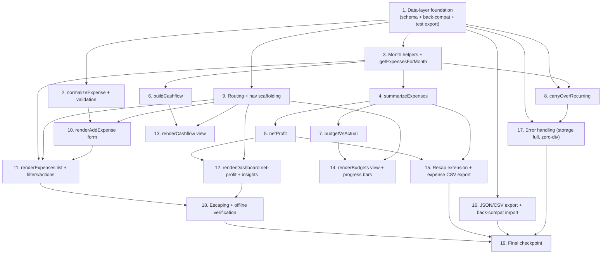

# Implementation Plan: Expense & Bookkeeping Module (Pengeluaran)

## Overview

This plan implements the expense / bookkeeping module for *Buku Keuangan Digital* by extending the existing vanilla-JS PWA files in place: `script.js` (data layer, router, render functions, aggregators, export/import), `index.html` (nav items), and `style.css` (progress bars, expense cards). No backend, no build step, and no runtime framework are introduced.

The work is sequenced so each task builds on the previous one: data-layer foundations first (schema, normalization, month helpers), then pure aggregators (each validated by a property-based test right after it is built), then the UI views that consume them, then Rekap/export/import extensions, and finally error-handling, escaping, and offline verification. Property-based tests use `fast-check` and run as a **dev-only** standalone harness (functions exported under a `typeof module !== "undefined"` guard) so the shipped app stays dependency-free.

Implementation language: **JavaScript (vanilla, ES2017+)** — consistent with the existing codebase and the design document's code samples.

### Testing conventions

- Property tests use `fast-check` and live in a dev-only harness (e.g. `tests/expense.props.test.js`) run with Node; the shipped app loads no test code.
- Each property sub-task is tagged: **Feature: expense-bookkeeping, Property {n}: {text}** and references the design property and the requirement clauses it validates.
- Property tests run a minimum of 100 iterations.
- Aggregators are exported under a `typeof module !== "undefined" && module.exports` guard so they are importable by the harness without affecting browser execution.
- Sub-tasks marked with `*` are optional (tests) and can be skipped for a faster MVP; non-`*` sub-tasks are core implementation.

---

## Task Dependency Graph

---

## Tasks

- [ ] 1. Extend the data layer with expenses, budgets, and back-compatible load
  - In `script.js`, extend `defaultDB()` to return `expenses: []` and `budgets: {}` alongside the existing keys.
  - Update `loadDB()` so the merge guarantees `db.expenses` is always an array and `db.budgets` is always an object even when the stored JSON lacks those keys (legacy data): `expenses: Array.isArray(parsed.expenses) ? parsed.expenses : []`, `budgets: (parsed.budgets && typeof parsed.budgets === "object") ? parsed.budgets : {}`.
  - Add the `EXPENSE_CATEGORIES` constant (`Iklan/Ads`, `Langganan Tools`, `Kuota/Internet`, `Listrik`, `Operasional`, `Fee Platform`, `Gaji/Komisi`, `Lainnya`).
  - Add a `typeof module !== "undefined" && module.exports = { ... }` guard at the end of `script.js` exporting the pure functions for the dev test harness (no effect in the browser).
  - _Requirements: 12.5, 8.4_

  - [ ]* 1.1 Write property test for backward-compatible load
    - **Property 8: Backward-compatible load** — *For any* legacy backup object lacking `expenses`/`budgets`, loading yields `db.expenses === []` and `db.budgets === {}` with all legacy `transactions`/`products`/`targets`/`settings` preserved.
    - **Validates: Requirements 12.5, 12.4**

- [ ] 2. Implement expense normalization and validation
  - Add `normalizeExpense(data, id = null)` returning a fully-populated `Expense` (`id`, `createdAt`, `updatedAt`, `date`, `name`, `category`, `amount`, `payment`, `recurring`, optional `recurringFrom`, `note`).
  - Trim `name`; coerce `amount` via `number()`; coerce `recurring` to boolean; fall back `category` to `"Lainnya"` when missing/unknown; fall back `date` to `today()`.
  - On edit (`id` supplied), preserve original `id` and `createdAt`, refresh `updatedAt`; do not mutate `db`.
  - _Requirements: 1.4, 1.5, 1.6, 1.7_

  - [ ]* 2.1 Write property test for non-negative persisted amounts
    - **Property 3: Non-negative expense amounts persisted** — *For any* form input that passes validation, the persisted expense has `number(amount) > 0`; inputs with `amount <= 0` or empty trimmed `name` are rejected.
    - **Validates: Requirements 1.1, 1.2, 1.3, 1.6**

- [ ] 3. Add month helpers and month-scoped expense retrieval
  - Add `getExpensesForMonth(monthKey = state.activeMonth)` returning only expenses where `getMonthKey(date) === monthKey` (reuse existing `getMonthKey`); no mutation of the source array.
  - Add a `firstDayOf(monthKey)` helper returning `"YYYY-MM-01"` for use by the recurring carry-over.
  - _Requirements: 4.5_

  - [ ]* 3.1 Write property test for month isolation
    - **Property 10: Month isolation** — *For any* set of expenses and any `monthKey`, every result of `getExpensesForMonth(m)` has `getMonthKey(date) === m`, and no in-month expense is omitted.
    - **Validates: Requirements 4.5, 2.1**

- [ ] 4. Implement summarizeExpenses (category breakdown + top category)
  - Add `summarizeExpenses(expenses)` computing `total` (sum of `number(amount)`), `count`, `byCategory` map, and `topCategory` (`{label,value}`).
  - Return `total: 0` and `topCategory: { label: "-", value: 0 }` for empty input.
  - _Requirements: 4.1, 4.2, 4.3, 4.4_

  - [ ]* 4.1 Write property test for expense total equals category sum
    - **Property 2: Expense total = category sum** — *For any* list of expenses, `summarizeExpenses(list).total` equals the sum of `byCategory` values, and `topCategory` is the category with the maximum accumulated amount (or `{label:"-",value:0}` when empty).
    - **Validates: Requirements 4.1, 4.2, 4.3, 4.4**

- [ ] 5. Implement netProfit aggregator
  - Add `netProfit(monthKey)` returning `{ income, grossProfit, expenses, net, isProfit }` where `income`/`grossProfit` come from existing `summarize(getTransactionsForMonth(monthKey))`, `expenses` from `summarizeExpenses(getExpensesForMonth(monthKey)).total`, `net = grossProfit - expenses`, and `isProfit = net >= 0`. Read-only over `db`.
  - _Requirements: 5.1, 5.2_

  - [ ]* 5.1 Write property test for net profit identity
    - **Property 1: Net profit identity** — *For any* `monthKey`, `netProfit(m).net === netProfit(m).grossProfit - netProfit(m).expenses` and `isProfit === (net >= 0)`.
    - **Validates: Requirements 5.1, 5.3, 5.4**

- [ ] 6. Implement buildCashflow (daily & monthly)
  - Add `buildCashflow(monthKey, granularity)` for `granularity ∈ {"day","month"}`: day mode buckets month-scoped tx/expenses by full date, month mode buckets all-time tx/expenses by `getMonthKey`.
  - Accumulate `in` from active (non-refund) transactions via `calcTotal` and `isActive`; accumulate `out` from `number(amount)`; set `net = in - out` per point; return points sorted ascending by `key`.
  - _Requirements: 7.1, 7.2, 7.3, 7.4, 7.5_

  - [ ]* 6.1 Write property test for cashflow net consistency and refund exclusion
    - **Property 4: Cashflow net consistency** — *For any* generated tx/expense set and granularity, every point satisfies `net === in - out`, points are sorted ascending by key, and **Property 5: Refunds excluded from money-in** — refund transactions never contribute to any point's `in`.
    - **Validates: Requirements 7.3, 7.4, 7.5**

- [ ] 7. Implement budgetVsActual with classification
  - Add `budgetVsActual(monthKey)` producing one `BudgetRow` per category present in `db.budgets[monthKey]` or in actual spending: compute `planned`, `actual`, `pct = planned > 0 ? actual/planned*100 : 0`, and `level` (`none` when `planned === 0`; `over` when `actual > planned > 0`; `warn` when `planned > 0` and `80 <= pct <= 100`; else `ok`). Sort rows by `actual` descending.
  - _Requirements: 9.1, 9.2, 9.3, 9.4, 9.5, 9.6, 9.7_

  - [ ]* 7.1 Write property test for budget classification correctness
    - **Property 6: Budget classification correctness** — *For any* `planned`/`actual` pairs, `level === "over"` iff `actual > planned > 0`; `level === "warn"` iff `planned > 0 ∧ 80 <= pct <= 100`; `level === "none"` iff `planned === 0`; otherwise `ok`; and `pct` is `0` (never non-finite) when `planned === 0`.
    - **Validates: Requirements 9.2, 9.3, 9.4, 9.5, 9.6, 13.2**

- [ ] 8. Implement carryOverRecurring (idempotent monthly carry-over)
  - Add `carryOverRecurring(monthKey)`: find recurring templates (`recurring === true` and no `recurringFrom`); for each template lacking an instance for `monthKey`, clone it with a new `uid("exp")`, `date = firstDayOf(monthKey)`, `recurringFrom = template.id`, refreshed timestamps; treat a template dated in `monthKey` as already present.
  - Call `saveDB()` only when at least one instance was created; return the count created.
  - _Requirements: 3.1, 3.2, 3.3, 3.5_

  - [ ]* 8.1 Write property test for recurring idempotency
    - **Property 7: Recurring idempotency** — *For any* set of recurring templates and `monthKey`, calling `carryOverRecurring(m)` twice produces the same set of instances as calling it once (exactly one instance per template per month).
    - **Validates: Requirements 3.1, 3.3, 3.4, 3.5**

- [ ] 9. Add expense routes and navigation scaffolding
  - In `script.js`, add nav entries for `pengeluaran`, `cashflow`, and `anggaran`, and register `pengeluaran → renderExpenses`, `tambah-pengeluaran → renderAddExpense`, `cashflow → renderCashflow`, `anggaran → renderBudgets` in the `render()` routes map (use temporary placeholder render functions to keep routing wired with no orphaned code).
  - Initialize `state.expenseFilters` (search, category, payment, sort) mirroring `state.filters`.
  - Update `index.html` nav containers if any static markup needs the new items, keeping the data-driven `navItems` rendering intact.
  - _Requirements: 2.1, 7.1, 8.1_

- [ ] 10. Implement the add/edit expense form (renderAddExpense)
  - Replace the placeholder with `renderAddExpense()` rendering a form (date, description/name, category select from `EXPENSE_CATEGORIES`, amount, payment select from `PAYMENTS`, recurring checkbox, note), supporting edit population via `state.editingId`.
  - On submit, call `normalizeExpense`; if invalid (empty trimmed name or `amount <= 0`) call `toast("Jumlah & deskripsi pengeluaran wajib diisi")` and do not persist; otherwise push or replace in `db.expenses`, `saveDB()`, set active month, and route to `pengeluaran`.
  - _Requirements: 1.1, 1.2, 1.3, 2.8_

  - [ ]* 10.1 Write unit tests for form validation branches
    - Test that empty description and `amount <= 0` are rejected and the store is unchanged; valid input persists exactly one expense; edit preserves `id`/`createdAt`.
    - _Requirements: 1.1, 1.2, 1.3, 1.7_

- [ ] 11. Implement the expense list view with filter/search/sort/delete/duplicate/edit
  - Replace the placeholder with `renderExpenses()` showing month-scoped expenses (desktop table + mobile cards), with search on description, category filter, payment filter, and date/amount sort via an `applyExpenseFilters(items)` helper.
  - Wire actions: delete removes from `db.expenses`; duplicate creates a new expense with a new `uid("exp")` copied from the selected one; edit sets `state.editingId` and routes to `tambah-pengeluaran`.
  - _Requirements: 2.1, 2.2, 2.3, 2.4, 2.5, 2.6, 2.7, 2.8, 14.2_

  - [ ]* 11.1 Write property test for filter/sort correctness
    - *For any* expense set and filter selection, `applyExpenseFilters` returns only items matching every active predicate, and the sorted output is a stable reordering of that filtered subset.
    - _Requirements: 2.2, 2.3, 2.4, 2.5_

- [ ] 12. Extend the dashboard with net-profit cards and expense insights
  - In `renderDashboard()`, add three cards using `netProfit(state.activeMonth)`: Total Income, Total Expenses (bad style), and Net Profit (good/bad style by `isProfit`) with month label.
  - Add insight rows: largest expense category (`summarizeExpenses(...).topCategory.label`) and expense-vs-revenue ratio (`income ? expenses/income*100 : 0`, rendered via `pctValue`).
  - _Requirements: 5.3, 5.4, 5.5, 6.1, 6.2, 6.3_

- [ ] 13. Implement the cashflow view (renderCashflow)
  - Replace the placeholder with `renderCashflow()` rendering daily and monthly series from `buildCashflow`, showing per-point in/out/net and a surplus indicator when `net >= 0` and deficit when `net < 0`.
  - Render an empty state when there are no points.
  - _Requirements: 7.1, 7.2, 7.6, 7.7_

- [ ] 14. Implement the budget view with progress-bar warnings (renderBudgets)
  - Replace the placeholder with `renderBudgets()`: per-category inputs that store planned amounts at `db.budgets[monthKey][category]` (coerced via `number()`, zero/blank = no budget), rendering controls only for `EXPENSE_CATEGORIES`.
  - Render a progress bar per `budgetVsActual` row with width `Math.min(100, pct)` and a CSS class reflecting `level` (`none`/`ok`/`warn`/`over`).
  - Add `.progress.ok`, `.progress.warn`, `.progress.over`, and expense-card styles to `style.css`.
  - _Requirements: 8.1, 8.2, 8.3, 8.4, 9.1, 9.7, 9.8_

- [ ] 15. Extend the Rekap view with net profit and expense CSV export
  - In `renderRecap()`, add a combined monthly bookkeeping summary for the active month showing omzet, Gross Profit, total expenses, and Net Profit (via `netProfit`/`summarizeExpenses`).
  - Add `exportExpensesCSV(items, filename)` and wire buttons to export active-month expenses and all-time expenses; retain the existing transaction export buttons.
  - _Requirements: 10.1, 10.2, 10.3, 10.4, 11.2, 11.3_

  - [ ]* 15.1 Write unit tests for expense CSV formatting
    - Verify header columns are `Tanggal, Deskripsi, Kategori, Jumlah, Metode Pembayaran, Berulang, Catatan`, that `recurring` maps to `"Ya"`/`"Tidak"`, and that quoting matches the existing CSV helper.
    - _Requirements: 11.2, 11.3_

- [ ] 16. Extend JSON export and import with backward compatibility
  - Confirm `exportJSON()` serializes the full `db` (now including `expenses`/`budgets`); no change needed beyond verification.
  - Extend `handleImportFile()` merge so `expenses` falls back to `[]` (non-array) and `budgets` falls back to `{}` (non-object), while preserving legacy keys and the existing invalid-file guard.
  - _Requirements: 11.1, 12.1, 12.2, 12.3, 12.4, 12.7_

  - [ ]* 16.1 Write property test for export/import round-trip
    - **Property 9: Export/import round-trip** — *For any* `db` with random transactions/expenses/budgets/targets/settings, parsing `exportJSON` output back through the import merge reproduces all five sections equivalently.
    - **Validates: Requirements 11.1, 12.1, 12.6**

  - [ ]* 16.2 Write unit tests for legacy import fallbacks
    - Verify imports missing/invalid `expenses` yield `[]`, missing/invalid `budgets` yield `{}`, and an unparseable file or non-array `transactions` triggers `toast("Import gagal: file JSON tidak valid")` leaving `db` unchanged.
    - _Requirements: 12.2, 12.3, 12.7_

- [ ] 17. Add error handling for storage and zero-division
  - Wrap `saveDB()` writes in a try/catch (or add a guarded save) so a quota failure calls `toast("Penyimpanan penuh, export & hapus data lama")` and leaves previously stored data intact.
  - Audit ratio/percentage computations (`budgetVsActual.pct`, expense-vs-revenue ratio) to guard zero denominators and return `0` instead of `NaN`/`Infinity`.
  - _Requirements: 13.1, 13.2, 13.3_

  - [ ]* 17.1 Write unit tests for zero-division guards
    - Verify ratio is `0` when income is `0` and `pct` is `0` when planned is `0` (no non-finite values).
    - _Requirements: 13.2, 13.3_

- [ ] 18. Ensure HTML escaping and preserve offline behavior
  - Confirm every render path for user-supplied expense `name`, `category`, and `note` passes through `escapeHTML()`; fix any unescaped interpolation in the new views.
  - Verify the expense module performs no network requests and that the existing service worker still caches the app shell (no new fetch dependencies introduced).
  - _Requirements: 14.1, 14.2, 14.3_

  - [ ]* 18.1 Write unit test for escaping
    - Render an expense whose name/note contains `<script>` and angle/quote characters and assert the output contains the escaped entities, not raw markup.
    - _Requirements: 14.1_

- [ ] 19. Final checkpoint - ensure all tests pass
  - Ensure all property and unit tests pass and the app runs offline with expense, cashflow, and budget views wired into navigation; ask the user if questions arise.

## Notes

- Tasks marked with `*` are optional (tests) and can be skipped for a faster MVP; all non-`*` sub-tasks are core implementation.
- Each task references the specific requirement clauses it implements for traceability.
- Property test sub-tasks map directly to the 10 design correctness properties (Properties 1–10) and are placed next to the code they validate to catch errors early.
- Property tests use `fast-check` in a dev-only harness; the shipped PWA remains dependency-free and offline-capable.
